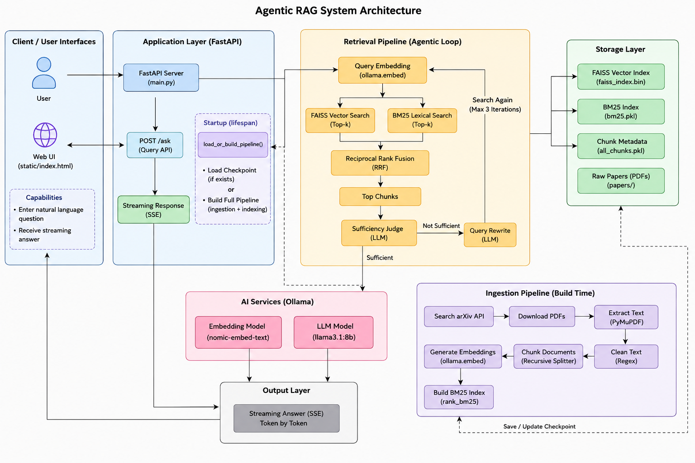
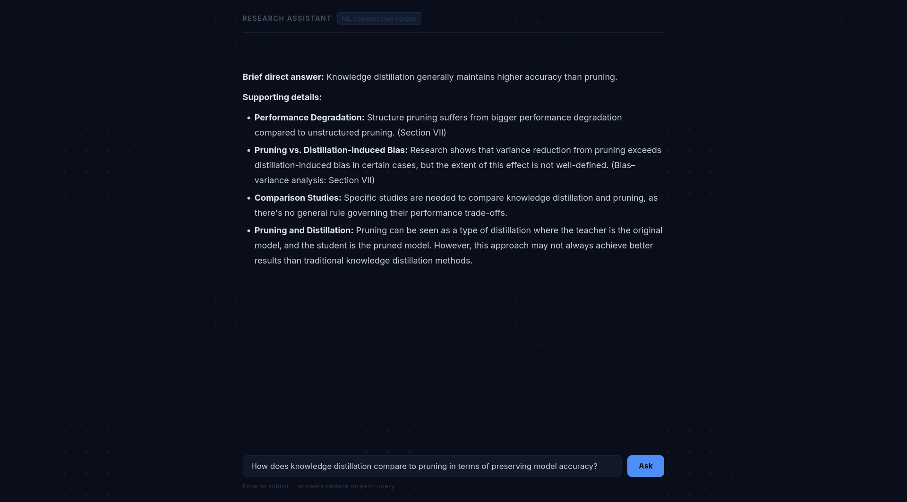

# Efficiency Literature RAG

A literature-navigation tool for the fragmented model-efficiency research area (quantization, pruning, distillation), using hybrid retrieval + agentic multi-hop reasoning.

## Architecture



Pipeline: arXiv ingestion → clean → chunk (RecursiveCharacterTextSplitter) → embed (nomic-embed-text) → FAISS + BM25 hybrid index → RRF fusion → agentic loop (LLM judges sufficiency, re-retrieves if needed) → generation (Llama 3.1:8b)

## Demo



## Why hybrid + agentic (not just vanilla RAG)

The core research question: does hybrid retrieval + agentic reasoning outperform single-shot dense retrieval on this corpus? Evaluation is in progress — see [Roadmap](#roadmap).

## Tech stack

- **Ingestion:** arXiv API (feedparser), PyMuPDF
- **Chunking:** LangChain `RecursiveCharacterTextSplitter`
- **Embedding / generation:** Ollama (`nomic-embed-text`, `llama3.1:8b`)
- **Retrieval:** FAISS (`IndexFlatL2`), `rank_bm25`
- **Serving:** FastAPI

## Setup

Requires [Ollama](https://ollama.com) installed and running locally.

```bash
git clone https://github.com/<your-username>/efficiency-literature-ml-rag.git
cd efficiency-literature-ml-rag

pip install -r requirements.txt

ollama pull nomic-embed-text
ollama pull llama3.1:8b

python main.py
```

## Corpus

300 papers from arXiv across three topics: quantization, pruning, and distillation. Scaling target: 500 papers.

## Limitations

- Local-only — no hosted deployment, requires Ollama running locally
- Corpus is currently scoped to ML-efficiency literature

## Roadmap

- LLM-as-judge evaluation vs. an 85%-baseline single-retrieval ChromaDB pipeline
- Scale corpus to 500 papers
